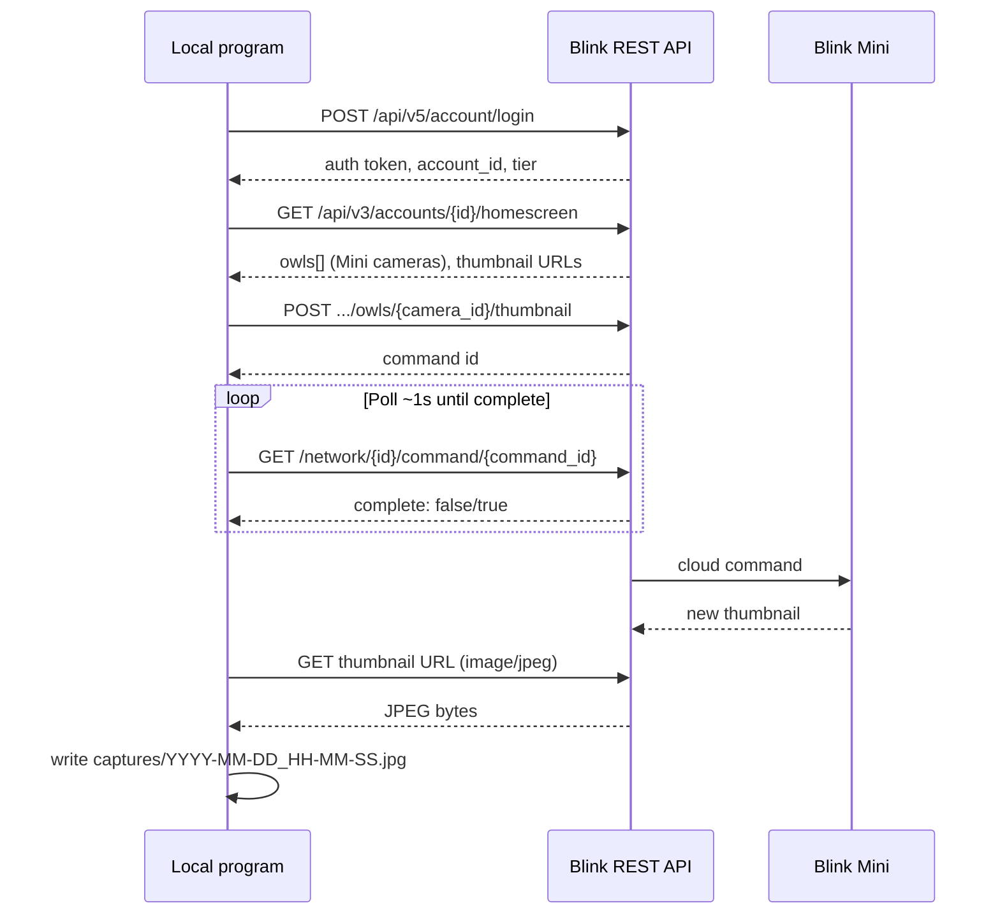

# Blink Mini local snapshot — implementation plan

Status: **CLI implemented** (`snap.py`). See [README.md](./README.md) for usage.

## Problem statement

Capture still images from a Blink Mini camera programmatically and store them on the local filesystem. Blink does not publish an official public API; integration relies on reverse-engineered endpoints documented by the community.

## How Blink “snapshots” actually work

Blink does not expose a generic “take photo” API in the sense of a full-resolution still. What third-party tools use is the **thumbnail** system:

1. **Request** — `POST` triggers the camera to capture a low-resolution preview image.
2. **Wait** — Blink returns a command ID; the server polls the camera (via sync module or direct Mini path) until `complete: true`.
3. **Download** — `GET` the JPEG from the URL in the camera’s `thumbnail` field (from homescreen / refresh).

Important limitations:

- Output is a **thumbnail**, not full HD. Resolution is suitable for monitoring/glance, not print quality.
- The capture path goes **through Blink’s cloud**, not a direct LAN stream to your machine.
- If the camera is busy (motion recording, live view, doorbell event), the thumbnail request may fail or return a stale image.

## Architecture (target state)



### Blink Mini vs sync-module cameras

| Aspect | Outdoor / Indoor (sync module) | Blink Mini |
|--------|--------------------------------|------------|
| Discovery | `cameras[]` on homescreen | `owls[]` on homescreen |
| Thumbnail trigger | `POST /network/{net}/camera/{id}/thumbnail` | `POST /api/v1/accounts/{acct}/networks/{net}/owls/{id}/thumbnail` |
| Local hub | Requires Sync Module online | Wi-Fi camera; no sync module for the Mini itself |
| blinkpy class | `BlinkCamera` | `BlinkCameraMini` |

BlinkMonitorProtocol documents the older sync-module paths; blinkpy adds Mini-specific `/owls/` routes (see [blinkpy `BlinkCameraMini.snap_picture`](https://github.com/fronzbot/blinkpy/blob/dev/blinkpy/camera.py)).

## Three approaches

### A. Python + blinkpy (recommended)

Wrap the official-unofficial library in a thin CLI.

**Flow**

```text
login → blink.start() / 2FA → blink.refresh() → find camera by name →
await camera.snap_picture() → await blink.refresh() → await camera.image_to_file(path)
```

**Pros**

- Blink Mini support is built in (`BlinkCameraMini`, `owls` endpoints).
- Handles regional base URLs (`rest-{tier}.immedia-semi.com`), retries, command polling.
- `image_to_file()` and `snap_picture()` match the exact use case.
- Active maintenance; used by Home Assistant’s Blink integration.
- MIT license.

**Cons**

- Python 3.9+, `aiohttp`, async/await — slightly more setup than a one-off curl script.
- Library API and 2FA flow change over time (e.g. `send_auth_key` → `send_2fa_code` + `setup_post_verify`).
- Pulls in dependency tree for a “small program” (acceptable for maintainability).

### B. Raw REST (curl / any HTTP client)

Implement [BlinkMonitorProtocol](https://github.com/MattTW/BlinkMonitorProtocol) yourself.

**Pros**

- No library lock-in; easy to port to Go, Rust, shell, etc.
- Full visibility into every request — good for learning and debugging.
- Smallest runtime if you only need login + one snapshot.

**Cons**

- Must implement: login, optional PIN verify, tier-based host, homescreen parse, **Mini-specific** `/owls/` paths (not all in BlinkMonitorProtocol README).
- Command polling loop and timeouts are manual.
- API drift — Blink returns `"An app update is required"` when endpoints are retired; you must update client version headers and paths.
- 2FA and `unique_id` / `reauth` session persistence are easy to get wrong.

### C. Node.js + node-blink-security

Same idea as blinkpy, different ecosystem.

**Pros**

- Fits if the rest of your stack is Node/TypeScript.
- Same underlying REST model.

**Cons**

- Less actively discussed for Blink Mini in recent issues than blinkpy.
- You still depend on undocumented API behavior.

**Recommendation:** **Approach A (blinkpy)** for the first implementation. Revisit B only if you need a non-Python binary or want minimal dependencies after the PoC works.

## Authentication and session management

Blink auth is non-trivial; plan for it up front.

| Step | API | Notes |
|------|-----|-------|
| Login | `POST /api/v5/account/login` | Returns `auth.token`, `account_id`, `tier`, `client_id` |
| Regional host | From `account.tier` | e.g. `https://rest-prod.immedia-semi.com` → `https://rest-e002.immedia-semi.com` |
| New client verification | `POST .../pin/verify` | Email/SMS PIN when `client_verification_required` |
| 2FA | blinkpy: `BlinkTwoFARequiredError` → `send_2fa_code` | PIN sent to account email |
| Session reuse | `unique_id` + `reauth: true` | Avoids repeated PIN prompts; token ~24h |

**For a local tool**

- Store credentials in `.env` or a JSON file **outside git** (see `.gitignore`).
- Persist blinkpy auth cache (tokens + `unique_id`) so cron jobs do not trigger 2FA every run.
- First run: interactive 2FA; later runs: load cached session.

**Security**

- Never commit `.env`, `blink_credentials.json`, or capture directories with sensitive images.
- Treat the auth token like a password — full account camera access.

## Local storage layout (proposed)

```text
blink/
├── captures/              # gitignored — saved JPEGs
│   └── 2026-06-05_14-30-00_mini-living-room.jpg
├── .env                   # gitignored — BLINK_USERNAME, BLINK_PASSWORD
├── blink_session.json     # gitignored — optional cached tokens
├── snap.py                # future: main CLI
├── PLAN.md
└── README.md
```

**Naming convention (suggestion)**

`{timestamp}_{camera-slug}.jpg` — e.g. `2026-06-05T14-30-00_living-room.jpg`.

**Optional later**

- Retention policy (delete older than N days).
- Separate subfolder per camera.

## Proposed minimal CLI (future)

```bash
# One-shot snapshot (default camera or first Mini)
python snap.py

# Named camera
python snap.py --camera "Living Room"

# Custom output directory
python snap.py --output ./captures
```

**Internal steps (pseudo)**

1. Load env / session file.
2. `Blink.start()` with error handling for 2FA.
3. `await blink.refresh()`.
4. Resolve camera: `blink.cameras["Living Room"]` or first entry in sync module / owl list.
5. `await camera.snap_picture()`.
6. `await blink.refresh()` (refresh thumbnail URL).
7. `await camera.image_to_file(output_path)`.
8. Log path and exit 0; non-zero on timeout or auth failure.

## Error handling to plan for

| Failure | Likely cause | Mitigation |
|---------|--------------|------------|
| Same JPEG every time | Stale thumbnail; camera busy recording | Retry with backoff; wait for motion/recording to finish |
| Command never completes | Offline camera / network | Timeout after ~30–60s; surface `status_msg` |
| `An app update is required` | Deprecated endpoint | Update blinkpy or mimic newer app User-Agent / API version |
| 401 / token expired | Session TTL | Re-login or `reauth` with saved `unique_id` |
| 2FA every run | Missing `unique_id` persistence | Use blinkpy credential save helpers |
| Rate limiting | Too many requests | Respect `refresh_rate` (default 30s in blinkpy); don’t snapshot in a tight loop |

Community reports (e.g. Home Assistant blink snapshot issues) note race conditions when **early notification** or motion clips run without a subscription — worth testing with your account settings.

## Pros and cons of the overall approach

### Pros

- No extra hardware; uses existing Blink Mini and account.
- Cloud path works from anywhere (laptop, homelab, cron) — no port forwarding.
- Well-trodden path via blinkpy / Home Assistant.
- Thumbnails are enough for timelapse, presence checks, or ML pipelines on low-res input.
- Local storage keeps data under your control (vs only in Blink app).

### Cons

- **Undocumented API** — Amazon/Blink can change or block it without notice.
- **Not official** — may violate ToS; use at your own risk for personal automation.
- **Thumbnail quality only** — not a substitute for RTSP/IP camera stills.
- **Latency** — round trip through cloud + command poll (often several seconds).
- **Auth friction** — 2FA and client verification complicate unattended runs.
- **Subscription / feature flags** — some app features (auto-update thumbnail) expect an active plan; manual snapshot API usually still works but behavior can vary.

## Alternatives considered (not recommended for v1)

| Alternative | Why skip for now |
|-------------|------------------|
| Live view / RTSP | Blink Mini RTSP is limited; liveview returns temporary RTSPS URLs — heavier and more fragile than thumbnails. |
| Local LAN API to camera | Mini is cloud-first; no stable documented local HTTP API for stills. |
| Blink mobile app automation | Fragile, not scriptable. |
| Screen-scraping Blink web app | Worse than REST reverse engineering. |

## Future extensions (out of scope for v1)

- Scheduled captures (cron / systemd timer).
- Multiple cameras in one run.
- Push to S3, NFS, or home automation (MQTT, Home Assistant webhook).
- Compare images (motion detection between frames).
- Video clip download (`record()` / `save_recent_clips()` in blinkpy).
- Docker image for headless homelab deployment.

## Resolution investigation (answered)

Blink Mini hardware captures up to **1920×1080** (1080p). The unofficial API exposes three practical still-image paths:

| Method | Endpoint / mechanism | Resolution | Verdict |
|--------|---------------------|------------|---------|
| **Thumbnail** | `POST .../thumbnail` → `GET` thumbnail JPEG | Low-res preview (~hundreds of px; compressed) | Default CLI mode; fast but not HD |
| **Live stream frame** | `POST .../liveview` → `immis://` → blinkpy TCP proxy → ffmpeg `-frames:v 1` | Up to 1080p | **Best balance** for HD stills; needs ffmpeg; stream stays up only briefly |
| **Video clip frame** | `POST .../clip` → download MP4 → ffmpeg extract frame | Up to 1080p | HD but slow; creates a clip in your Blink account; good fallback if live fails |

There is **no documented API for a native full-resolution still JPEG**. The app’s “Refresh Thumbnail” uses the same thumbnail pipeline the API exposes. Higher quality requires pulling a frame from the **live stream** or a **recorded clip**.

`snap.py` implements all three as `--mode thumbnail|live|clip` and prints saved dimensions so you can compare on your account.

### Live stream notes

- Blink Mini live view returns an `immis://` URL (proprietary), not plain RTSP.
- blinkpy’s `init_livestream()` proxies this to `tcp://127.0.0.1:<port>` as MPEG-TS.
- ffmpeg can grab a single frame from that TCP URL.
- See [blinkpy issue #343](https://github.com/fronzbot/blinkpy/issues/343) and [blink-immis-proxy](https://github.com/jakecrowley/blink-immis-proxy) for protocol background.

## Decisions made

1. **Trigger model** — Manual CLI first (cron/scheduling later).
2. **Camera selection** — Required `--camera` argument; `--list` to discover names.
3. **Runtime** — Python venv + blinkpy 0.25.5 (OAuth v2 + PKCE).
4. **Session** — `blink_session.json` via `blink.save()` after successful login.
5. **Resolution** — Default `thumbnail`; `--mode live` or `--mode clip` for ~1080p.

## Open questions (remaining)

1. **Scheduling** — cron/systemd interval once manual capture is verified?
2. **Preferred HD mode** — Is `live` reliable enough on your network, or is `clip` more dependable?
3. **Retention** — Auto-delete captures older than N days?

## Implementation checklist

- [x] Python venv; pin `blinkpy==0.25.5` in `requirements.txt`.
- [x] `.env.example` with `BLINK_USERNAME`, `BLINK_PASSWORD`.
- [x] `snap.py` CLI with `--camera`, `--list`, `--mode`, `--output`.
- [x] Session persistence via `blink_session.json`.
- [x] Document 2FA flow and resolution modes in README.
- [ ] Verify capture against a real Blink Mini (thumbnail + live + clip).
- [ ] Optional: cron wrapper / retention policy.

## References

- BlinkMonitorProtocol — thumbnail: [setThumbnail](https://github.com/MattTW/BlinkMonitorProtocol/blob/master/camera/setThumbnail.md), [getThumbnail](https://github.com/MattTW/BlinkMonitorProtocol/blob/master/camera/getThumbnail.md)
- Command polling: [command status](https://github.com/MattTW/BlinkMonitorProtocol/blob/master/network/command.md)
- Login: [auth/login](https://github.com/MattTW/BlinkMonitorProtocol/blob/master/auth/login.md)
- blinkpy camera helpers: `snap_picture`, `image_to_file` in [camera.py](https://github.com/fronzbot/blinkpy/blob/dev/blinkpy/camera.py)
- Blink support — thumbnail behavior: [Auto-Update Thumbnail](https://support.blinkforhome.com/using-your-camera/auto-update-thumbnail)
